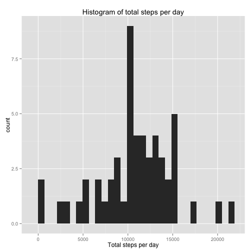
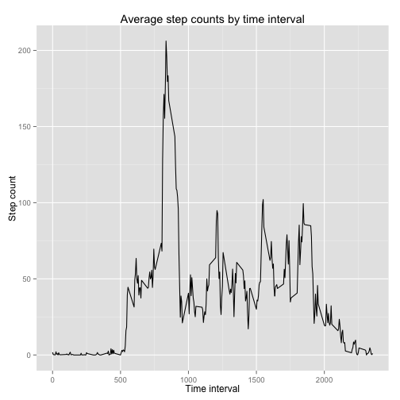
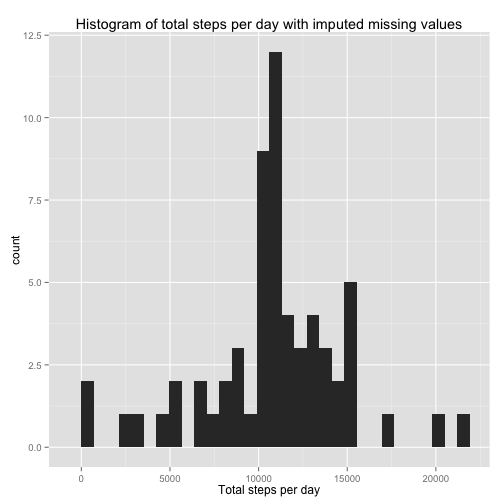
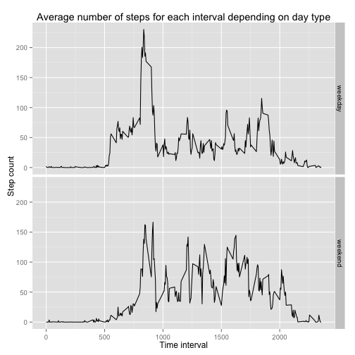

## Loading and preprocessing the data
At first we load libraries needed to complete the assigment:

```r
library(dplyr, warn.conflicts = F)
library(ggplot2)
library(lubridate)
```

We load the data from the zipped file into the dplyr data frame object:

```r
steps_data <- tbl_df(read.csv(unz("activity.zip", "activity.csv")))
```

## What is mean total number of steps taken per day?
We summarise step data by day, sum the step counts for each day.

```r
day_steps <- steps_data %>%
    group_by(date) %>%
    summarise(day_sum = sum(steps))
```

A histogram of day step counts:

```r
qplot(day_sum, 
      data = day_steps, 
      geom = "histogram", 
      main = "Histogram of total steps per day",
      xlab = "Total steps per day",
      binwidth = max(day_steps$day_sum, na.rm = T)/30)
```

 

The mean of day step count:

```r
print(mean(day_steps$day_sum, na.rm = T))
```

```
## [1] 10766.19
```

The median of day step count:

```r
print(median(day_steps$day_sum, na.rm = T))
```

```
## [1] 10765
```

## What is the average daily activity pattern?
We group the original dataset by 5-minute time intervals and compute the average:

```r
daily_pattern <- steps_data %>%
    group_by(interval) %>%
    summarise(interval_mean = mean(steps, na.rm = T))
```

Plot the data:

```r
qplot(x = interval,
      y = interval_mean,
      data = daily_pattern,
      geom = "line",
      main = "Average step counts by time interval",
      xlab = "Time interval",
      ylab = "Step count")
```

 

Print the interval (labelled as is in original dataset),
which maximizes the average step count:

```r
print(daily_pattern$interval[which.max(daily_pattern$interval_mean)])
```

```
## [1] 835
```

## Imputing missing values
The total count of missing values:

```r
print(sum(is.na(steps_data$steps)))
```

```
## [1] 2304
```

We impute the missing values by previously calculated means for 5-minute intervals:

```r
steps_data_imputed <- inner_join(steps_data, daily_pattern) %>%
    mutate(steps = ifelse(is.na(steps), as.integer(interval_mean), steps)) %>%
    select(-interval_mean)
```

```
## Joining by: "interval"
```

Compute total number of steps per day:

```r
day_steps_imputed <- steps_data_imputed %>%
    group_by(date) %>%
    summarise(day_sum = sum(steps))
```

A histogram of day step counts (with imputed values):

```r
qplot(day_sum, 
      data = day_steps_imputed, 
      geom = "histogram", 
      main = "Histogram of total steps per day with imputed missing values",
      xlab = "Total steps per day",
      binwidth = max(day_steps_imputed$day_sum, na.rm = T)/30)
```

 

The mean of day step count (with imputed values):

```r
print(mean(day_steps_imputed$day_sum))
```

```
## [1] 10749.77
```

The median of day step count (with imputed values):

```r
print(median(day_steps_imputed$day_sum))
```

```
## [1] 10641
```

Compared to the values computed from original data (before imputing missing values),
both mean and median of steps taken per day are sligtly less.

## Are there differences in activity patterns between weekdays and weekends?

At first we derive from column `date` a new column `weekday_nr`. If it's value is 1 (Sunday) or
7 (Saturday), we set value of another new column `day_type` to `"weekend"`, else to `"weekday"`.
Then we summarise the mean of steps according to time interval and day type.

```r
weekday_steps_data <- steps_data_imputed %>%
    mutate(weekday_nr = wday(date), day_type = ifelse(weekday_nr %in% c(1, 7), "weekend", "weekday")) %>%
    group_by(interval, day_type) %>%
    summarise(steps_mean = mean(steps))
```

The last but not the least comes the panel graph:

```r
qplot(interval, 
      steps_mean,
      data = weekday_steps_data,
      facets = day_type ~ .,
      geom = "line",
      main = "Average number of steps for each interval depending on day type",
      xlab = "Time interval",
      ylab = "Step count"
      )
```

 
